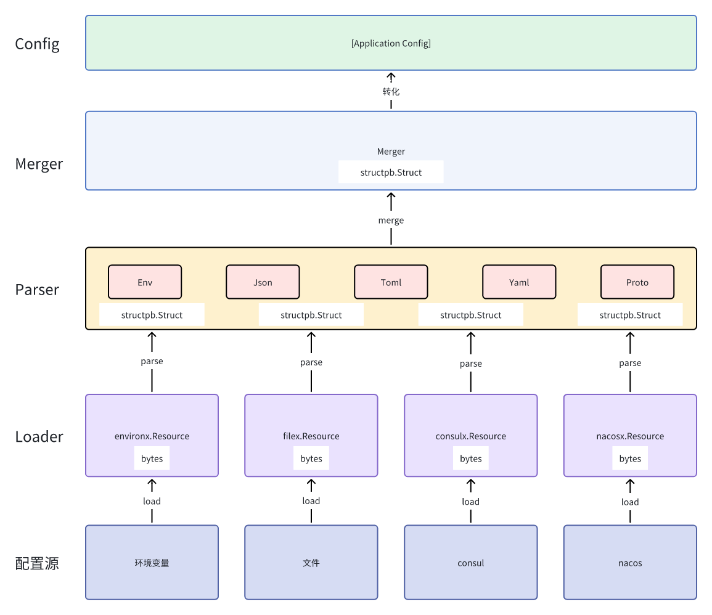

# 配置
一个应用程序可能从多个源获取配置。例如，应用程序可能从环境变量获取配置，从文件获取配置，从配置服务(例如: consul、nacos等)获取配置等。

Leo的configx包就是帮助开发者，从多个媒介中加载配置和监听配置。

# 配置源
Leo当前内置了四种源开箱即用：
1. [环境变量](https://github.com/go-leo/leo/tree/feature/v3/configx/environx)
2. [文件](https://github.com/go-leo/leo/tree/feature/v3/configx/filex)
3. [consul](https://github.com/go-leo/leo/tree/feature/v3/configx/consulx)
4. [nacos](https://github.com/go-leo/leo/tree/feature/v3/configx/nacosx)

# 配置的格式
Leo当前支持了五种常用的配置格式:
1. [Env](https://github.com/go-leo/leo/blob/feature/v3/configx/format.go#L21)
2. [Json](https://github.com/go-leo/leo/blob/feature/v3/configx/format.go#L44)
3. [Toml](https://github.com/go-leo/leo/blob/feature/v3/configx/format.go#L58)
4. [Yaml](https://github.com/go-leo/leo/blob/feature/v3/configx/format.go#L81)
5. [Proto](https://github.com/go-leo/leo/blob/feature/v3/configx/format.go#L105)

# 原理
## 加载/监听
`Loader` 从配置源加载配置内容`bytes(文本)`，通过`Parser`将`bytes(文本)`解析为`*structpb.Struct`。
通过`Merger`将多个`*structpb.Struct`合并为一个，最后将`*structpb.Struct`转换为应用程序自已定义的配置结构。



思维导图见[load.mermaid](../configx/load.mermaid) 和 [watch.mermaid](../configx/watch.mermaid)
 
# 实例
1. 创建一个proto配置文件：
```proto
syntax = "proto3";
package configx.test;

option go_package = "github.com/go-leo/leo/v3/configx/test/v1;test";

message Application {
  string addr = 1;
  int32 port = 2;
}
```
2. 生产pb文件：
```shell
protoc \
--proto_path=. \
--go_out=. \
--go_opt=paths=source_relative \
./*.proto
```
3. 假设在环境变量、文件、consul添加如下配置:
```go
var client *api.Client

func init() {
	os.Setenv("leo_run_env", "debug")
	var err error
	client, err = api.NewClient(api.DefaultConfig())
	if err != nil {
		panic(err)
	}
	_, err = client.KV().Put(&api.KVPair{
		Key: "redis",
		Value: []byte(`redis:
    addr: localhost:6379
    db: 0
    network: tcp
    password: test`),
	}, nil)
	if err != nil {
		panic(err)
	}

	err = os.WriteFile("/tmp/grpc.json", []byte(`{"grpc":{"addr":"localhost","port":8080}}`), 0644)
	if err != nil {
		panic(err)
	}
}
```
4. 加载配置
```go
func main() {
	config, err := configx.Load[*configs.Application](
		context.Background(),
		configx.WithResource(
			&environx.Resource{Prefix: "leo_"},
			&filex.Resource{Formatter: configx.Json{}, Filename: filename},
			&consulx.Resource{Formatter: configx.Yaml{}, Client: client, Key: "redis"},
		),
		configx.WithParser(configx.Env{}, configx.Json{}, configx.Yaml{}),
	)
	if err != nil {
		panic(err)
	}
	data, _ := protojson.Marshal(config)
	println(string(data))
}

```
5. 监听配置
```go
func main() {
	configC, errC, stop := configx.Watch[*configs.Application](
		context.Background(),
		configx.WithResource(
			&environx.Resource{Prefix: "leo_"},
			&filex.Resource{Formatter: configx.Json{}, Filename: filename},
			&consulx.Resource{Formatter: configx.Yaml{}, Client: client, Key: "redis"},
		),
		configx.WithParser(configx.Env{}, configx.Json{}, configx.Yaml{}),
	)

	go func() {
		for {
			time.Sleep(2 * time.Second)
			os.Setenv("leo_run_env", time.Now().Format(time.RFC3339))
		}
	}()

	go func() {
		for {
			time.Sleep(3 * time.Second)
			err := os.WriteFile(filename, []byte(fmt.Sprintf(`{"grpc":{"addr":"localhost","port":%d}}`, randx.Int31n(65535))), 0644)
			if err != nil {
				panic(err)
			}
		}
	}()

	go func() {
		for {
			time.Sleep(3 * time.Second)
			_, err := client.KV().Put(&api.KVPair{
				Key: "redis",
				Value: []byte(fmt.Sprintf(`redis:
	addr: "localhost:%d"
	db: %d
	network: tcp
	password: test`, randx.Intn(65535), randx.Intn(200))),
			}, nil)
			if err != nil {
				panic(err)
			}
		}
	}()

	for {
		select {
		case config := <-configC:
			data, _ := protojson.Marshal(config)
			println(string(data))
		case err := <-errC:
			if errors.Is(err, configx.ErrStopWatch) {
				return
			}
			println(err)
		case <-time.After(time.Minute):
			stop()
		}
	}
}
```

详细代码见[config](https://github.com/go-leo/leo/tree/feature/v3/example/cmd/features/config)
