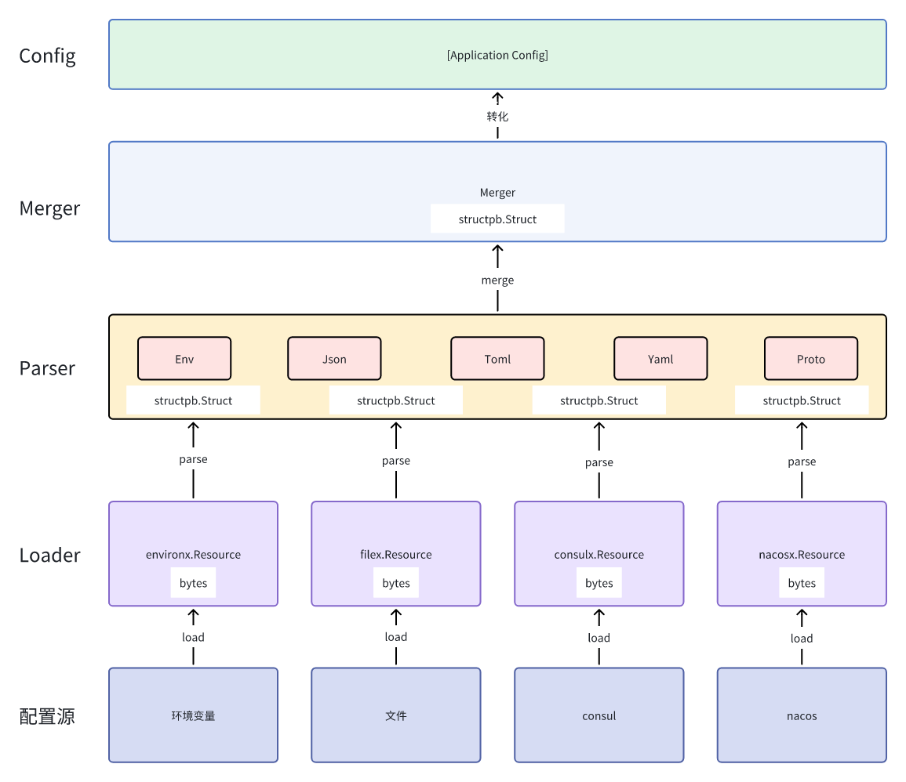

# 配置
一个应用程序可能从多个源获取配置。例如，应用程序可能从环境变量获取配置，从文件获取配置，从配置服务(例如: consul、nacos等)获取配置等。

Leo的configx包就是帮助开发者，从多个媒介中加载配置和监听配置。

# 配置源
Leo当前内置了四种源开箱即用：
1. [环境变量](https://github.com/go-leo/leo/tree/feature/v3/configx/environx)
2. [文件](https://github.com/go-leo/leo/tree/feature/v3/configx/filex)
3. [consul](https://github.com/go-leo/leo/tree/feature/v3/configx/consulx)
4. [nacos](https://github.com/go-leo/leo/tree/feature/v3/configx/nacosx)

# 配置的格式
Leo当前支持了五种常用的配置格式:
1. [Env](https://github.com/go-leo/leo/blob/feature/v3/configx/format.go#L21)
2. [Json](https://github.com/go-leo/leo/blob/feature/v3/configx/format.go#L44)
3. [Toml](https://github.com/go-leo/leo/blob/feature/v3/configx/format.go#L58)
4. [Yaml](https://github.com/go-leo/leo/blob/feature/v3/configx/format.go#L81)
5. [Proto](https://github.com/go-leo/leo/blob/feature/v3/configx/format.go#L105)

# 原理
## 加载/监听
`Loader` 从配置源加载配置内容`bytes(文本)`，通过`Parser`将`bytes(文本)`解析为`*structpb.Struct`。
通过`Merger`将多个`*structpb.Struct`合并为一个，最后将`*structpb.Struct`转换为应用程序自已定义的配置结构。



思维导图见[load.mermaid](../configx/load.mermaid) 和 [watch.mermaid](../configx/watch.mermaid)
 
# 用法
## 创建一个proto配置文件：
```proto
syntax = "proto3";
package internal.conf;
option go_package = "github.com/go-leo/leo/v3/example/configs/v1;configs";

import "leo/config/annotations.proto";

message Application {
  option (leo.config.enable) = true;
  string LEO_RUN_ENV = 1;
  GRPC grpc = 2;
  Redis redis = 4;
}

message GRPC {
  string addr = 1;
  int32 port = 2;
}

message Redis {
  string network = 1;
  string addr = 2;
  string password = 3;
  int32 db = 4;
}
```
注意：
1. 需要引入"leo/config/annotations.proto"。文件在[config](../proto/leo/config)下。
2. message上添加`option (leo.config.enable) = true;`注解，表明该message是配置结构，没有该注解，则不会被解析为配置结构。

## 生产pb文件：
```shell
protoc \
		--proto_path=. \
		--proto_path=../../proto/ \
		--proto_path=../../third_party \
		--go_out=. \
		--go_opt=paths=source_relative \
		--go-leo_out=. \
		--go-leo_opt=paths=source_relative \
		config.proto
```
注意：
1. --proto_path 选项需指定 leo/config/annotations.proto 所在的目录。

```go
// Code generated by protoc-gen-go-leo. DO NOT EDIT.

package configs

import (
	context "context"
	protox "github.com/go-leo/gox/protox"
	configx "github.com/go-leo/leo/v3/configx"
	sync "sync"
)

var (
	_ApplicationConfig      = &Application{}
	_ApplicationConfigMutex sync.RWMutex
)

func GetApplicationConfig() *Application {
	_ApplicationConfigMutex.RLock()
	defer _ApplicationConfigMutex.RUnlock()
	return protox.Clone(_ApplicationConfig)
}

func SetApplicationConfig(conf *Application) {
	_ApplicationConfigMutex.Lock()
	_ApplicationConfig = protox.Clone(conf)
	_ApplicationConfigMutex.Unlock()
}

func LoadApplicationConfig(ctx context.Context, opts ...configx.Option) error {
	conf, err := configx.Load[*Application](ctx, opts...)
	if err != nil {
		return err
	}
	SetApplicationConfig(conf)
	return nil
}

func WatchApplicationConfig(ctx context.Context, f func(err error), opts ...configx.Option) error {
	confC, err := configx.Watch[*Application](ctx, opts...)
	if err != nil {
		return err
	}
	go func() {
		for {
			select {
			case <-ctx.Done():
				return
			case conf := <-confC:
				SetApplicationConfig(conf)
			}
		}
	}()
	return nil
}

func LoadAndWatchApplicationConfig(ctx context.Context, f func(err error), opts ...configx.Option) error {
	if err := LoadApplicationConfig(ctx, opts...); err != nil {
		return err
	}
	return WatchApplicationConfig(ctx, f, opts...)
}
```
注意：
1. LoadXXXConfig方法加载配置
2. WatchXXXConfig方法监听配置
3. LoadAndWatchXXXConfig方法加载配置并监听配置


## 使用:
```go
package main

import (
	"context"
	"fmt"
	"github.com/go-leo/gox/contextx"
	"github.com/go-leo/leo/v3/configx"
	"github.com/go-leo/leo/v3/configx/environx"
	"github.com/go-leo/leo/v3/configx/filex"
	"github.com/go-leo/leo/v3/example/api/configs"
	"os"
	"time"
)

var content = `
{
  "grpc": {
    "addr": "localhost",
    "port": 10
  },
  "redis": {
    "network": "tcp",
    "addr": "localhost",
    "password": "%d",
    "db": 20
  }
}
`

var filename = "/tmp/config.json"

func init() {
	// Mock文件配置
	if err := os.WriteFile(filename, []byte(fmt.Sprintf(content, time.Now().Unix())), 0644); err != nil {
		panic(err)
	}
	// Mock环境变量配置
	os.Setenv("LEO_RUN_ENV", "this is leo run env")
}

func main() {
	// 文件资源
	fileRes := &filex.Resource{
		Filename: filename,
	}
	// 环境变量资源
	envRes := &environx.Resource{
		Prefix: "LEO",
	}

	// 加载配置
	ctx := context.Background()
	if err := configs.LoadApplicationConfig(
		ctx,
		configx.WithResource(fileRes, envRes),
	); err != nil {
		panic(err)
	}
	// 获取配置
	fmt.Println(configs.GetApplicationConfig())

	// 监听配置, stop停止监听
	ctx, stop := context.WithCancel(ctx)
	defer stop()
	if err := configs.WatchApplicationConfig(ctx, configx.WithResource(fileRes, envRes)); err != nil {
		panic(err)
	}

	// 加载并监听配置
	if err := configs.LoadAndWatchApplicationConfig(ctx, configx.WithResource(fileRes, envRes)); err != nil {
		panic(err)
	}

	go func() {
		// 模拟配置文件变化和环境变量变化
		for {
			if time.Now().Second()%2 == 0 {
				file, err := os.OpenFile(filename, os.O_WRONLY, 0644)
				if err != nil {
					panic(err)
				}
				_, err = file.WriteString(fmt.Sprintf(content, time.Now().Unix()))
				if err != nil {
					panic(err)
				}
			} else {
				os.Setenv("LEO_RUN_ENV", fmt.Sprintf("this is leo run env, %s", time.Now().String()))
			}
			time.Sleep(time.Second)
		}
	}()

	go func() {
		for {
			time.Sleep(time.Second)
			// 获取配置
			fmt.Println(configs.GetApplicationConfig())
		}
	}()

	ctx, cancelFunc := contextx.Signal(os.Interrupt)
	defer cancelFunc()
	<-ctx.Done()
}
```

详细代码见[config](../example/config)
