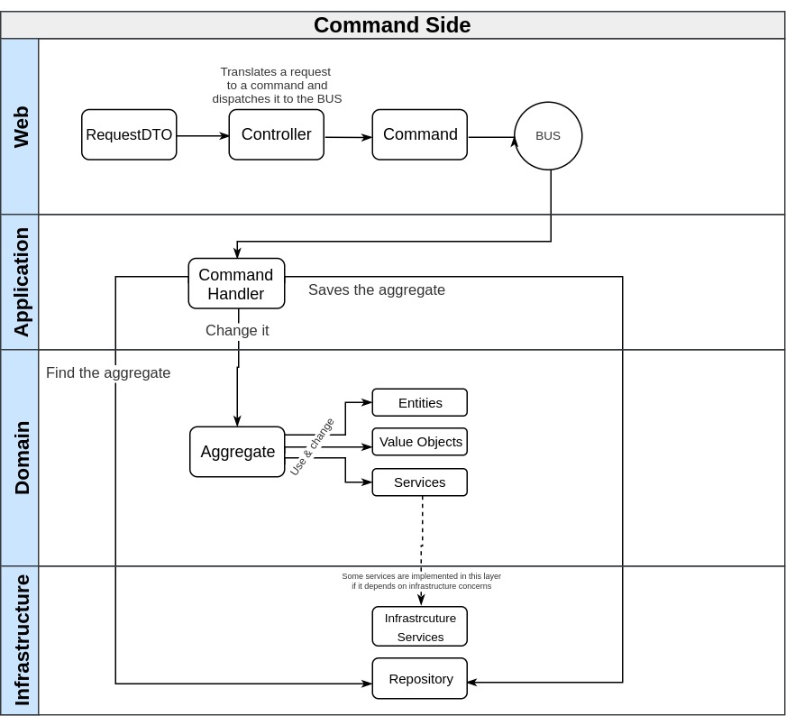
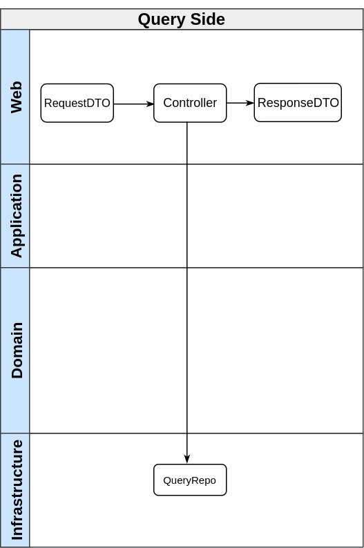

# project-layout

**ddd layout** is a open-source project meant to be used to  as a start point, or an inspiration, for those who want to build Domain Driven Design applications in Golang.

**NOTE:** This is NOT intended to be a definitive solution or a production ready project

# Architecture overview

## Layers
- **presentation**: http controllers, grpc provider, schedule task, message subscriber, console command.
- **application**: Orchestrates the jobs in the domain needed to be done to accomplish a certain "use case"
- **Domain**: Where the business rules resides
- **infrastructure**: Technologies concerns resides here (database access, sending emails, calling external APIs)

## CQRS

CQRS splits your application (and even the database in some cases) into two different paths: **Commands** and **Queries**.

### Command side

Every operation that can trigger an side effect on the server must pass through the CQRS "command side". I like to put the `Handlers` (commands handlers and events handlers) inside the application layer because their goals are almost the same: orchestrate domain operations (also usually using infrastructure services).

### Query side

Pretty straight forward, the controller receives the request, calls the related query repo and returns a DTO (defined on infrastructure layer itself).

