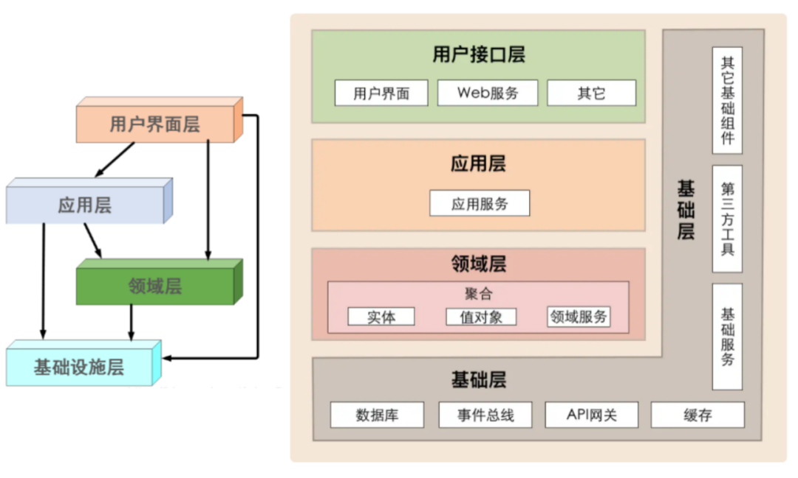
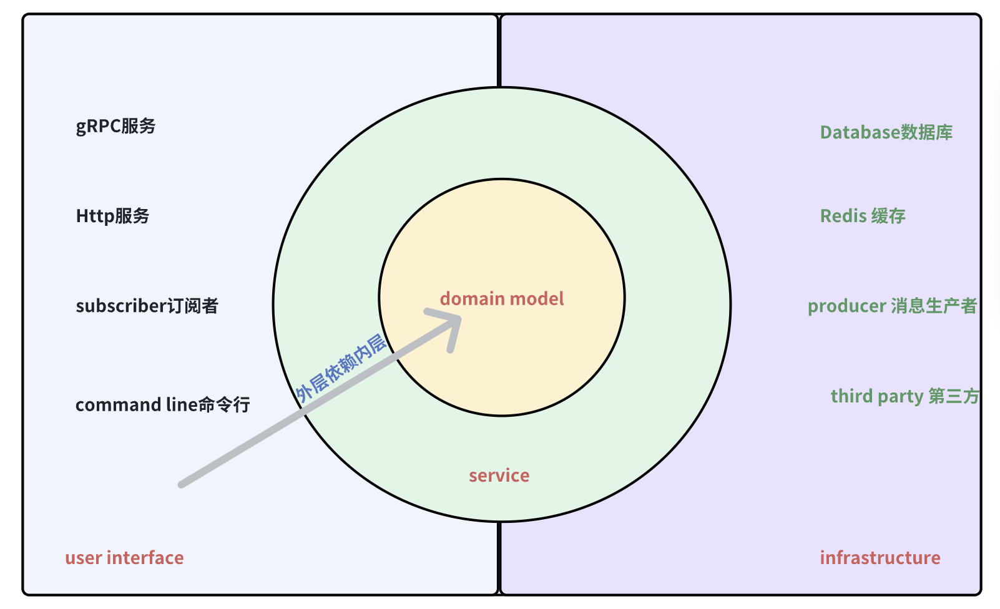
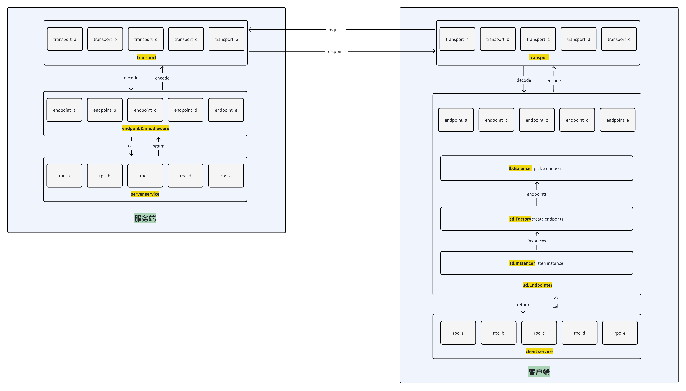

# generator

Leo提供一个 `leo` 工具 和 `protoc-gen-go-leo` protoc插件

* `leo`可以初始化项目和应用
* `protoc-gen-go-leo` 可以生成HTTP和gRPC的代码，还可以生成配置、状态码等代码。

# 安装

```bash
go install github.com/go-leo/leo/v3/cmd/leo@latest
go install github.com/go-leo/leo/v3/cmd/protoc-gen-go-leo@latest
```

# leo 命令

`leo`命令有两子命令

## 1. 创建一个新项目

```
leo project -m github.com/go-leo/example
```

项目结构如下：

```
.
├── app
├── configs
├── deployments
├── docs
├── githooks
├── go.mod
├── go.sum
├── internal
├── pkg
├── scripts
├── third_party
└── tools
```

* app：应用目录，创建的应用会生成到该目录下
* configs：配置文件目录
* deployments：部署文件目录
* docs：文档目录
* githooks：git钩子目录
* go.mod,go.sum：go模块文件
* internal：私有目录, 项目内部共享但不想导出的的代码放到该目录下
* pkg：公共目录，项目内部共享且可以导出的代码放到该目录下
* scripts：脚本目录
* third_party：第三方依赖目录
* tools：工具目录

## 2. 创建一个新应用
>项目结构采用DDD的四层架构.



进入项目目录

```
cd example
```

创建应用

```
leo app -n user
```

应用结构如下：

```
.
├── api
├── cmd
├── domain
├── infra
├── protoc.sh
├── service
└── ui
```

* api：api目录，存放proto定义文件和生成的代码
* cmd: 应用启动目录，存放main函数与子命令
* domain：领域层目录，存放领域模型代码
* infra：基础设施层目录，存放基础设施代码
* protoc.sh: protoc编译脚本
* service：服务层目录，存放业务服务代码(把应用服务和领域服务合在一起)
* ui：ui层目录，存放 user interface 代码



# protoc-gen-go-leo 插件
protoc-gen-go-leo 插件可以生成一下代码:
* HTTP代码
* gRPC代码
* 状态码
* 配置

## service
```protobuf
syntax = "proto3";

option go_package = "github.com/go-leo/leo/v3/example/api/helloworld/v1;helloworld";

package helloworld;

import "google/api/annotations.proto";

service Greeter {
  rpc SayHello (HelloRequest) returns (HelloReply) {
    option (google.api.http) = {
      post: "/v1/example/echo"
      body: "*"
    };
  }
}

message HelloRequest {
  string name = 1;
}

message HelloReply {
  string message = 1;
}
```
运行下命令
```go
protoc \
		--proto_path=. \
		--proto_path=../../proto/ \
		--proto_path=../../third_party \
		--go_out=. \
		--go_opt=paths=source_relative \
		--go-grpc_out=. \
        --go-grpc_opt=paths=source_relative \
		--go-leo_out=. \
		--go-leo_opt=paths=source_relative \
		*/*/*.proto
```
将生成下面几个文件
```
.
├── helloworld.pb.go
├── helloworld_grpc.pb.go
├── helloworld_leo.core.pb.go
├── helloworld_leo.grpc.pb.go
└── helloworld_leo.http.pb.go
```
* helloworld.pb.go 是命令中`--go_`实际是`protoc-gen-go`生成的protobuf文件
* helloworld_grpc.pb.go 是命令中`--go-grpc_`实际是`protoc-gen-go-grpc`生成的gRPC文件
* helloworld_leo.x.pb.go 是命令中`--go-leo_`实际是`protoc-gen-go-leo`生成的文件
  * helloworld_leo.core.pb.go 是命令中`--go-leo_`生成的核心的 go-kit 代码
  * helloworld_leo.grpc.pb.go 是命令中`--go-leo_`生成的基于 go-kit gRPC transport 代码,
  * helloworld_leo.http.pb.go 是命令中`--go-leo_`生成的基于 go-kit HTTP transport 代码

这里简单介绍一下go-kit的核心概念，先看一张图


* transport: 传输层，负责传输请求和响应并对其编解码, 多协议时，只需要增加transport即可
* endpoint: endpoint 代表一个RPC方法, 在 server 和 client有所区别.
  * server endpoint 相当于是包装下层service的方法，调用endpoint,就相当于调用service的方法。
  * client endpoint 除了要包装转化请求和响应类型外，还要通过服务发现组件来生成。
* service: RPC service， 服务端就是具体的业务代码，客户端是RPC方法，

## status code
生成状态码，详情请看[status.md](status.md)

## config
生成配置，详情请看[config.md](config.md)