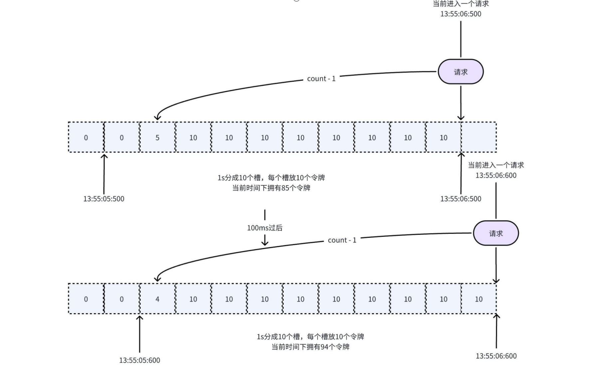
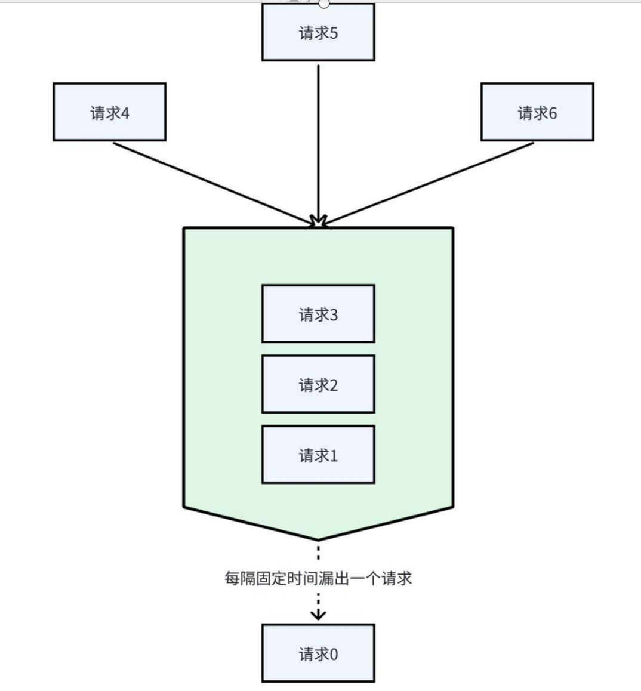
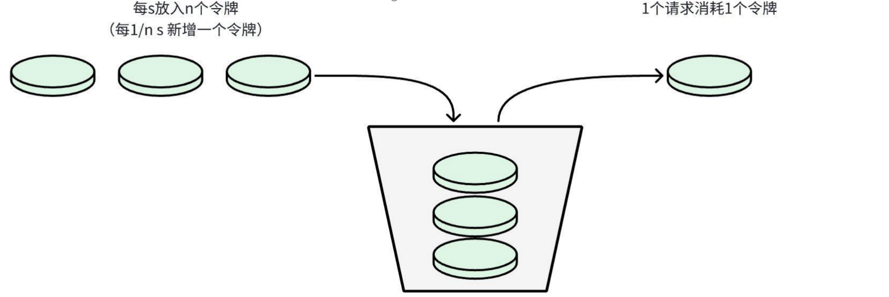

# 限流
Leo提供了多种限流算法，包括
* 滑动窗口
* 漏桶
* 令牌桶
* Redis分布式限流
* BBR限流

# 使用
## 滑动窗口
原理：
* 滑动窗口限流解决固定窗口临界值的问题。
* 它将单位时间周期分为n个小周期，分别记录每个小周期内接口的访问次数，并且根据时间滑动删除过期的小周期。
* 滑动窗口算法能够动态地跟踪并限制每个时间窗口内的接口访问频率，从而实现限流的目的。
* 避免了突发的高峰流量导致实际的QPS远高于限流的QPS，且槽的数量越多限流的准确性越高
* 到达限流后，请求都会直接暴力被拒绝, 会损失一部分请求。

```go
package main

import (
	"context"
	"github.com/RussellLuo/slidingwindow"
	"github.com/go-leo/leo/v3"
	"github.com/go-leo/leo/v3/example/api/helloworld/v1"
	"github.com/go-leo/leo/v3/ratelimitx"
	"github.com/go-leo/leo/v3/serverx/grpcserverx"
	"github.com/go-leo/leo/v3/transportx/grpctransportx"
	"log"
	"time"
)

type server struct{}

func (s *server) SayHello(ctx context.Context, in *helloworld.HelloRequest) (*helloworld.HelloReply, error) {
	return &helloworld.HelloReply{Message: "Hello " + in.GetName()}, nil
}

func main() {
	grpcSrv := grpcserverx.NewServer(grpcserverx.Port(50051))
	// 滑动窗口，每秒10个请求
	limiter, stopFunc := slidingwindow.NewLimiter(time.Second, 10, func() (slidingwindow.Window, slidingwindow.StopFunc) { return slidingwindow.NewLocalWindow() })
	// 退出时关闭
	defer stopFunc()
	mdw := ratelimitx.SlideWindow(limiter)
	grpcServer := helloworld.NewGreeterGrpcServer(
		&server{},
		grpctransportx.Middleware(mdw),
	)
	helloworld.RegisterGreeterServer(grpcSrv, grpcServer)
	if err := leo.NewApp(leo.Runner(grpcSrv)).Run(context.Background()); err != nil {
		log.Fatalf("failed to serve: %v", err)
	}
}
```

## 漏桶
原理：
* 往漏桶中以任意速率流入水，以固定的速率流出水。
* 当水超过桶的容量时，会被溢出，也就是被丢弃。
* 因为桶容量是不变的，保证了整体的速率。


* 流入的水滴，可以看作是访问系统的请求，这个流入速率是不确定的。
* 桶的容量一般表示系统所能处理的请求数。
* 如果桶的容量满了，就达到限流的阀值，就会丢弃水滴（拒绝请求）
* 流出的水滴，是恒定过滤的，对应服务按照固定的速率处理请求。
* 但是面对突发流量的时候，漏桶算法还是循规蹈矩地处理请求，我们肯定希望系统尽量快点处理请求。

```go
package main

import (
	"context"
	"github.com/go-leo/leo/v3"
	"github.com/go-leo/leo/v3/example/api/helloworld/v1"
	"github.com/go-leo/leo/v3/ratelimitx"
	"github.com/go-leo/leo/v3/serverx/grpcserverx"
	"github.com/go-leo/leo/v3/transportx/grpctransportx"
	"go.uber.org/ratelimit"
	"log"
)

type server struct{}

func (s *server) SayHello(ctx context.Context, in *helloworld.HelloRequest) (*helloworld.HelloReply, error) {
	return &helloworld.HelloReply{Message: "Hello " + in.GetName()}, nil
}

func main() {
	grpcSrv := grpcserverx.NewServer(grpcserverx.Port(50051))
	// 漏桶，每秒10个请求
	exitC := make(chan struct{})
	// 退出时关闭exitC
	defer close(exitC)
	mdw := ratelimitx.LeakyBucket(ratelimit.New(10), exitC)
	grpcServer := helloworld.NewGreeterGrpcServer(
		&server{},
		grpctransportx.Middleware(mdw),
	)
	helloworld.RegisterGreeterServer(grpcSrv, grpcServer)
	if err := leo.NewApp(leo.Runner(grpcSrv)).Run(context.Background()); err != nil {
		log.Fatalf("failed to serve: %v", err)
	}
}
```

## 令牌桶
面对突发流量的时候，我们可以使用令牌桶算法限流。

原理：
* 有一个令牌管理员，根据限流大小，定速往令牌桶里放令牌。
* 如果令牌数量满了，超过令牌桶容量的限制，那就丢弃。
* 系统在接受到一个用户请求时，都会先去令牌桶要一个令牌。如果拿到令牌，那么就处理这个请求的业务逻辑；
* 如果拿不到令牌，就直接拒绝这个请求。


```go
func main() {
	grpcSrv := grpcserverx.NewServer(grpcserverx.Port(50051))
	// 令牌桶，每秒10个请求
	mdw := ratelimitx.TokenBucket(rate.NewLimiter(10, 10))
	grpcServer := helloworld.NewGreeterGrpcServer(&server{},
		grpctransportx.Middleware(mdw),
	)
	helloworld.RegisterGreeterServer(grpcSrv, grpcServer)
	if err := leo.NewApp(leo.Runner(grpcSrv)).Run(context.Background()); err != nil {
		log.Fatalf("failed to serve: %v", err)
	}
}
```

## Redis分布式限流
redis分布式限流采用了[GCRA](https://en.wikipedia.org/wiki/Generic_cell_rate_algorithm)算法

通用信元速率算法（GCRA）是一种用于异步传输模式（ATM）网络的流量控制算法，其核心目标是通过检查信元（数据单元）的到达时间，确保流量符合预定的带宽和抖动限制。

```go
func main() {
	grpcSrv := grpcserverx.NewServer(grpcserverx.Port(50051))
	client := redis.NewClient(&redis.Options{Addr: "localhost:6379"})
	// 令牌桶，每秒10个请求
	mdw := ratelimitx.Redis(redis_rate.NewLimiter(client), redis_rate.PerSecond(10), func(ctx context.Context) string { return "redis_limiter" })
	grpcServer := helloworld.NewGreeterGrpcServer(&server{},
		grpctransportx.Middleware(mdw),
	)
	helloworld.RegisterGreeterServer(grpcSrv, grpcServer)
	if err := leo.NewApp(leo.Runner(grpcSrv)).Run(context.Background()); err != nil {
		log.Fatalf("failed to serve: %v", err)
	}
}

```

## BBR
BBR是一种自适应限流算法，通过动态调整并发请求数来平衡系统吞吐量和响应时间。

BBR限流算法的核心思想是:
* 持续监控系统的关键指标(CPU使用率、请求通过量、响应时间)
* 根据这些指标动态计算系统的最大承载能力
* 当系统负载接近或超过这个能力时进行限流
```go
func main() {
	grpcSrv := grpcserverx.NewServer(grpcserverx.Port(50051))
	mdw := ratelimitx.BBR(bbr.NewLimiter())
	grpcServer := helloworld.NewGreeterGrpcServer(&server{},
		grpctransportx.Middleware(mdw),
	)
	helloworld.RegisterGreeterServer(grpcSrv, grpcServer)
	if err := leo.NewApp(leo.Runner(grpcSrv)).Run(context.Background()); err != nil {
		log.Fatalf("failed to serve: %v", err)
	}
}
```